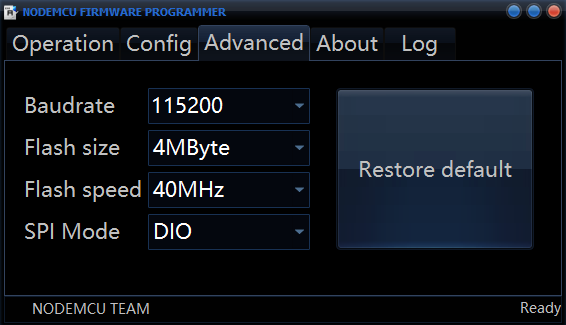
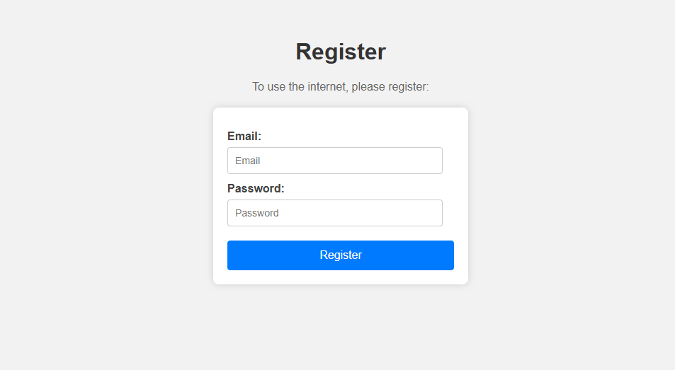

# NodeMCU-ESP8266-Captive-Portal-&-DNS-Spoofing
Tento mini projekt slúži na testovanie známeho útoku typu Captive Portal v prostredí Wi-Fi sietí. Zariadenie ESP8266 funguje ako prístupový bod (AP), ktorý vysiela vlastnú Wi-Fi sieť. Po pripojení zariadenia používateľa k tejto sieti je každý pokus o prístup na internet presmerovaný na registračnú stránku, ktorá žiada zadanie prihlasovacích údajov (email a heslo) – podobne ako to robia verejné Wi-Fi siete.

## Využitý hardware
- `NodeMCU ESP8266 with 0.96 OLED Display`
- `Prepojovacie káble samec-samec`
- `1x Zelená Led, 1x Červená Led, 1x Modrá Led`
- `3x 1k ohm rezistor`
- `Breadboard`
- `Powerbanka`

## Program
- Vytvára otvorenú WiFi prístupovú sieť s pevnou IP adresou.
- Spúšťa DNS server, ktorý presmeruje všetky požiadavky na zariadenie.
- Hostí jednoduchý webový server s prihlasovacím formulárom pre registráciu používateľov.
- Ukladá zadaný email a heslo, sleduje celkový počet pokusov o pripojenie a úspešných registrácií.
- Používa tri LED diódy pre indikáciu stavu:
  - Modrá LED stále bliká, signalizuje aktívny AP režim.
  - Zelená LED bliká po úspešnej registrácii.
  - Červená LED bliká pri chybe.
- Na OLED displeji zobrazuje štatistiky pripojení a IP adresu.
- Stránka so zoznamom uložených údajov je chránená základným HTTP overením.

## Nahratie kódu do ESP8266
- Ako prvé je potrebne v Arduino IDE exportovať compilovany binárny súbor: `Sketch/Export Compiled Binary`. Vznikne nám súbor s koncovkou `.bin`.
- Následne je potrebné nainštalovať ESP Flasher: `https://github.com/nodemcu/nodemcu-flasher`.
- Po spustení flasheru nastavíme v sekci `Config` cestu kde máme `.bin` kód uloženy a adresu necháme na `0x00000`.
- V sekcií `Advanced` nastavíme `Baudrate - 115200`, `Flash size - 4MByte`, `Flash speed - 40MHt` a `SPI Mode - DIO`.

  
   
  <i>Obrázok 1 NodeMCU Flasher - Advanced</i>

- Následne pripojíme NodeMCU ESP8266 do PC a prejdeme vo Flasheri do sekcie `Operation`, kde zvolíme `COM Port` a spustíme `Flash`.

## Zapojenie
- Zapojíme NodeMCU ESP8266 do Breadboardu. Čevená led je zapojená do `D1`, zelená led do `D2` a modrá led do `D7`, pričom každá led využíva aj 1k ohm rezistor.

  
   
  <i>Obrázok 2 Zapojenie a spustenie</i>

## Testovanie AP
- Po spustení NodeMCU ESP8266 sa pripojte na AP `MyWiFi` a presmeruje Vás na registračnú stránku.

  
   
  <i>Obrázok 3 Registrácia v Captive Portal</i>

- Následne zadajte náhodné údaje pre registráciu a nastane presmerovanie na stránku úspešnej registrácie.

  
   
  <i>Obrázok 4 Úspešná registrácia</i>

- K zachytenám údajom préjdite do url `194.162.4.1/data`, pričom sa musíte overiť meno `admin` a heslo `admin`.

  
   
  <i>Obrázok 5 Zachytené dáta</i>

## Poznámka k projektu
Tento projekt slúži výhradne na vzdelávacie účely v oblasti kybernetickej bezpečnosti. Autor nenesie žiadnu zodpovednosť za akékoľvek zneužitie tohto kódu na neetické alebo nelegálne účely
